# GMG — SI-Quality Figures & Progress Snapshot

Curated, maintained-quality figures for this project, organized by topic/method rather
than strictly by date. Each section leads with the **current** figure(s) + a one-line
takeaway, followed by a short dated changelog of what changed and why. This is a
*selection*, not a full history — for every change (including ones later superseded),
see `log_and_conventions.md`. `graphene_4x1_manual` lp1 (edge) is the most complete and
settled; lp2 (interior) now has a first-pass dispersion overview too (§2b) but it's
still in the comparison/exploration stage (shows both q/2q conventions side by side,
several flagged fit artifacts) — not yet a validated result like lp1's. lp2's
peak2-3/two-wave sections are still pending. `graphene_3x1_manual` not started yet.

**Maintenance**: update opportunistically (a major method change or a result worth
keeping), not every session/day.

---

## 1. Linecut extraction geometry (ROI preview)

Where the linecuts feeding every downstream fit actually come from: the perpendicular-
averaging rectangle (ROI) drawn on the raw amp map, plus the resulting aligned waterfall
across all 15 wn. This is the foundation everything else in this doc builds on — worth
checking visually since a wrong ROI (position/width) silently propagates into every fit.

**Latest** (2026-07-23), lp1 (left edge):
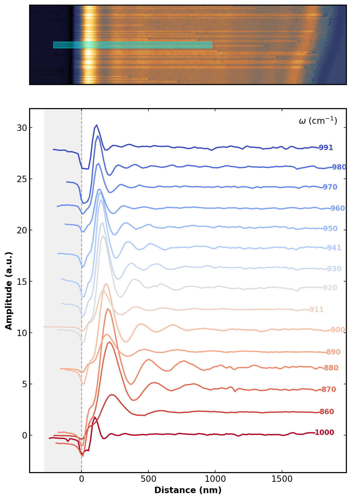

**Latest** (2026-07-23), lp2 (right edge) — extraction still being tuned, ROI/width may
change further:
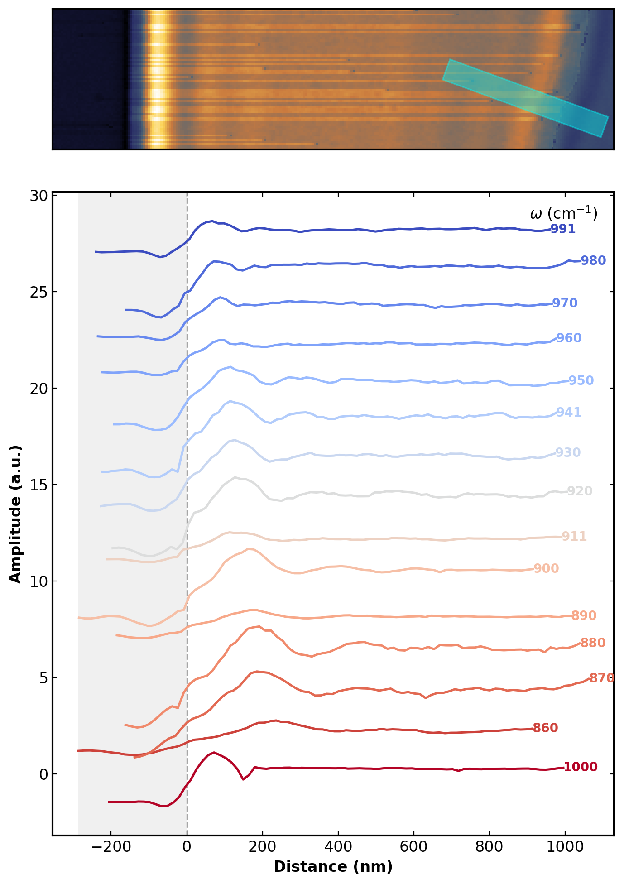

Takeaway: lp1's ROI (0.077μm perpendicular width, 2.0μm long) has been stable and is the
basis for all lp1 results elsewhere in this doc. lp2's perpendicular averaging width was
just doubled to 0.154μm (2026-07-23) to reduce noise — its fits haven't been re-tuned
against the new linecuts yet (see changelog).

Changelog:
- 2026-07-23: fixed a bug in the notebook's own ROI-preview cells
  (`manual_linecut_pipeline_graphene_4x1.ipynb`) — the rectangle overlay for lp1 was
  reading a shared global (`DEFAULT_WIDTH_UM`) that gets reassigned right before the lp2
  section runs, so the *preview* could silently show lp2's width even for an lp1 figure,
  even though lp1's actual extracted data was never affected (confirmed via git diff:
  lp1's exported CSVs were byte-identical throughout). Fixed to read each edge's own
  stored width instead of the shared/mutable global. Also: lp2's perpendicular averaging
  width doubled (0.077→0.154μm) to reduce noise; re-ran the same tuned real-space fit
  params (`xr_range`/`lam0_guess`) on old vs. new lp2 data and found meaningful q_p shifts
  at most wn (10-27% at 8 of 15 wn) — that tuning needs a fresh visual pass, not a
  carry-over from before the width change.

---

## 2. Dispersion overview: rp(q,ω) cross-check

Combines every independent q_p estimate (hankel, FFT, real-space peak spacing) on top
of the simulated Im(r_p) ridge — the single best "does everything agree" figure. §2a
(lp1) is a settled result; §2b (lp2) is still in the comparison/exploration stage, so
it deliberately shows both q/2q conventions side by side rather than one "final" answer.

### 2a. lp1 (left edge)

**Latest** (2026-07-22):

Takeaway: all 4 methods agree well with the ridge for 860-920 and 950/980cm-1; 930/941/
960/970/991 show real per-point scatter (~10-20%) that isn't resolved by any single
method; 1000cm-1 remains the least certain point (two-wave hankel and peak2-3 spacing
agree reasonably at ~1.8-2.4e5 cm-1, but FFT is unresolved on both channels there).

Changelog:
- 2026-07-16: FFT added to the cross-check with FWHM error bars; peak labeling fixed to
  a physics-based "always 2q, /2-corrected" convention.
- 2026-07-17: amp/complex FFT channel degeneracy explained (not a bug — phase is nearly
  flat in the tuned fit window, so `|FFT(complex)| ~ |FFT(amp)|`).
- 2026-07-22: extended from 860-911 to the full 860-1000cm-1 range — added two-wave
  Hankel fits and real-space peak2-peak3 spacing for 920-1000cm-1; fixed a peak
  misidentification at 941 and 1000cm-1 (see §3); switched the FFT point at 991/1000cm-1
  from amp to phase channel (amp too noisy at these two wn).

### 2b. lp2 (right edge) — comparison stage, not settled

**Latest / working version** (2026-07-23) — hankel (single-wave 860-890, two-wave
900-1000) + FFT "2q/2" only (the "q"/first-peak reading was dropped, see takeaway) +
real-space peak2-peak3 spacing (all 15 wn, see §3b for the peak-picking diagnostic):
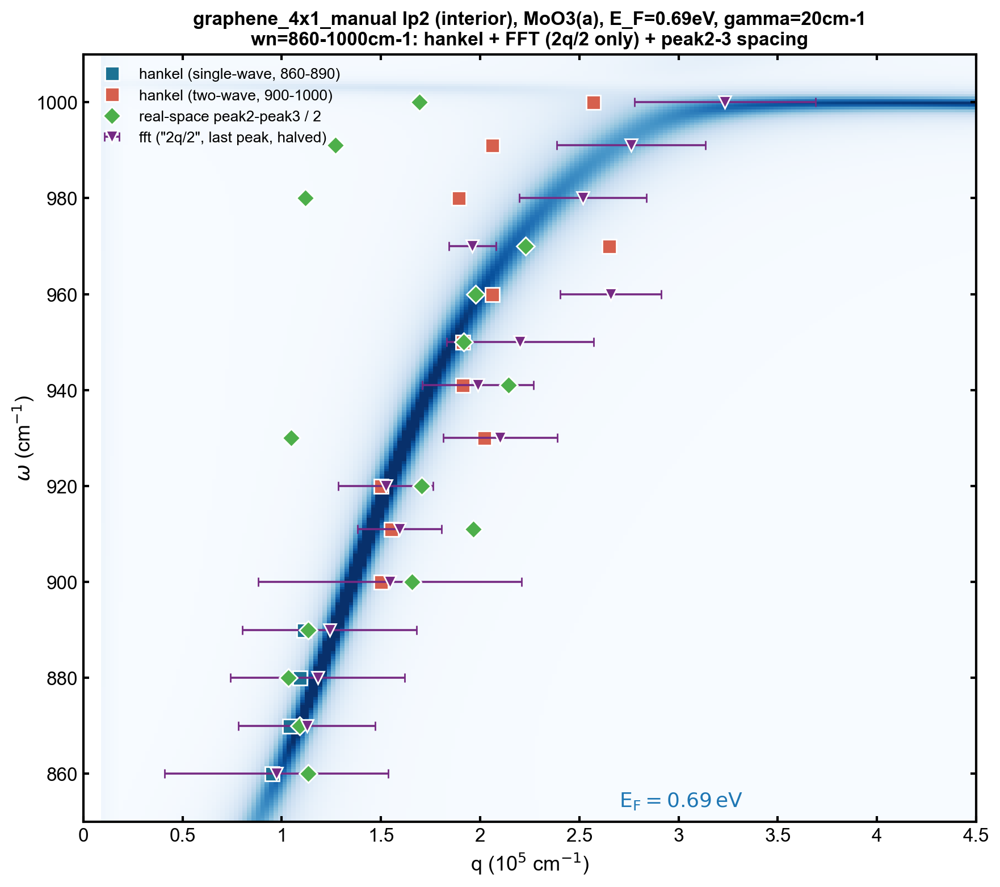

**E_F scan, side by side** (2026-07-23) — same plot at E_F=0.60/0.63/0.64/0.65/0.67/0.69eV
(0.64eV added just to fill the 2x3 grid evenly; 0.69eV is only a carried-over reference
from lp1, never actually checked against lp2's own data before this):
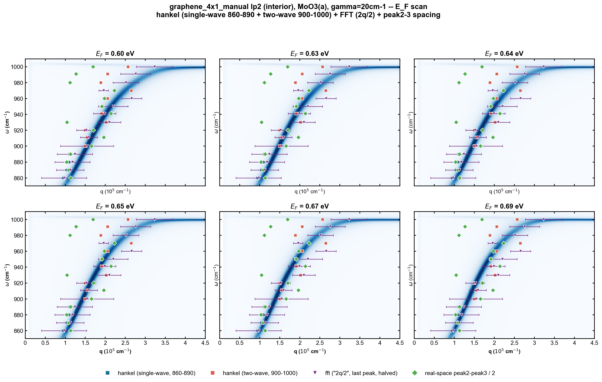

Takeaway: 860-920 track the ridge well at every E_F tried, hankel/FFT/peak2-3 all agree
closely. Lower E_F (0.60-0.64eV) also pulls 930-950 onto the ridge more tightly than
0.67-0.69eV does. 960-1000: FFT's "2q/2" sits notably to the right of the ridge relative
to hankel two-wave at every E_F — not an E_F effect, not yet resolved. Peak2-3 spacing
agrees well with hankel two-wave/FFT at most wn but is a real outlier at 930 and 1000
(~40-50% lower than the other two methods) — checked carefully (not a mis-picked peak,
see §3b) and still unresolved; may indicate the real-space signal at those two wn has
extra structure (multiple close sub-peaks) that this simple 2-peak method doesn't
capture well. E_F not yet picked; 0.69eV kept as the single-figure default above pending
that decision.

**How this was chosen** — kept for the record, not re-plotted going forward:

*Hankel only* (2026-07-23):
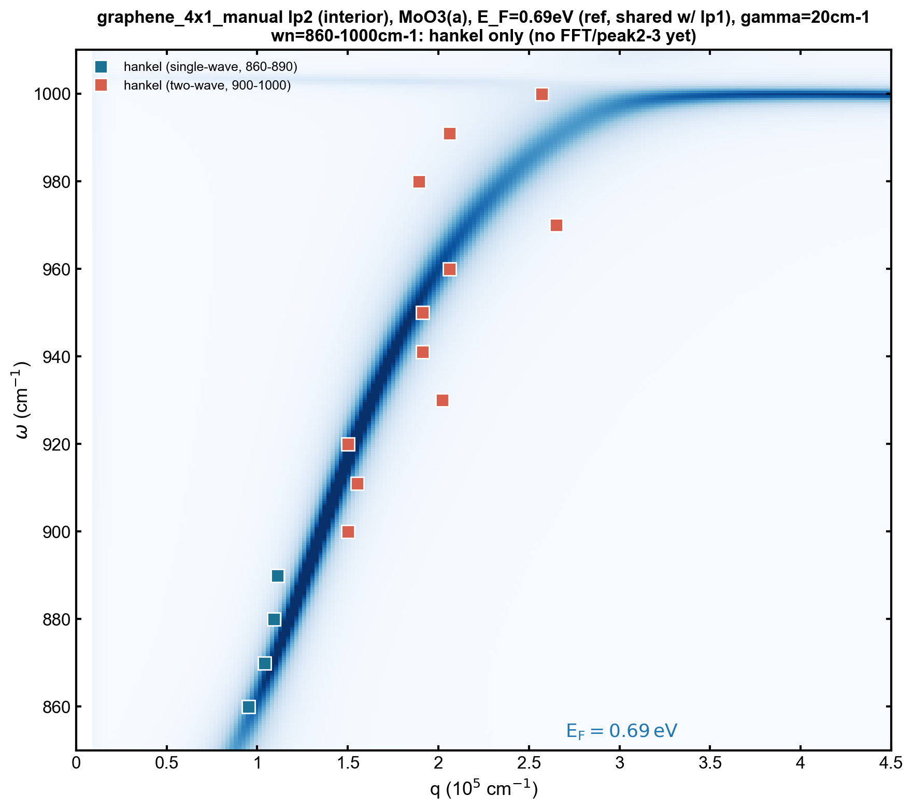

*Hankel + FFT, "q" vs "2q/2" shown side by side* (2026-07-23) — this comparison is why
"2q/2" was kept and "q" (direct first peak) dropped: "q"'s FWHM error bars were much
larger (less reliable), even though its central values often tracked the ridge closely:
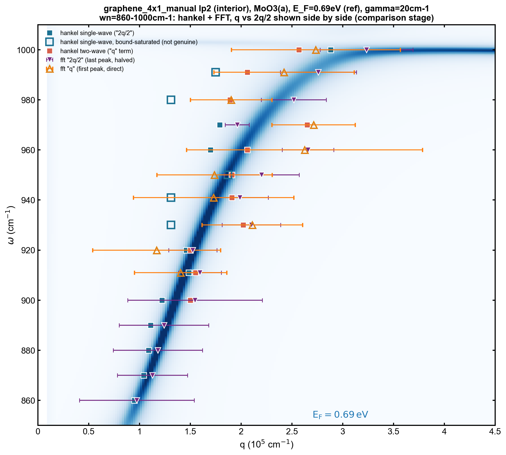

Changelog:
- 2026-07-23: first hankel-only overlay after the user's full parameter tuning pass;
  found 7/15 wn (911,930,941,950,960,980,991) single-wave Hankel results are bound-
  saturation artifacts (exactly `1.2*lam0_guess`, not genuine convergence — see
  `log_and_conventions.md`), and 2/11 two-wave results (920,960) were degenerate
  (`Q_2q`→inf). Both flagged with open/hatched markers rather than silently plotted.
  Second version adds FFT (with FWHM error bars) and explicitly separates "q" (direct
  first peak) from "2q/2" (last peak, halved) instead of assuming lp1's already-
  validated "always 2q" convention carries over unchecked.
- 2026-07-23 (same day, follow-up): user re-tuned 920/960's two-wave cells
  (`xr_range_2wave`/`q_guess_2wave`) — both now converge genuinely (920: Q_2q=17.3;
  960: Q_2q=10.9), no longer flagged.
- 2026-07-23 (same day, decision): compared "q" vs "2q/2" above and decided to drop "q"
  (FWHM error bars too large to trust) and keep "2q/2" only going forward. New "clean"
  plot built with only the genuine hankel points (single-wave 860-890, two-wave
  900-1000 — the 7 bound-saturated single-wave wn simply omitted rather than flagged,
  since two-wave already gives a genuine answer for that same range) + FFT "2q/2".
- 2026-07-23 (same day, follow-up): attempted to fix the 7 bound-saturated single-wave
  wn by tuning `lam0_guess` (911,930,941,950,960,980,991). Fixed 2/7: **911cm-1**
  (`lam0_guess`: 0.6→0.405, genuine convergence to λ=423.4nm/q=1.484e5, stable across
  lam0_guess=0.37-0.49) and **960cm-1** (`lam0_guess`: 0.3→0.375 + widened
  `lam_bound_factor=(0.85,1.15)` just for this wn, genuine convergence to λ=370.1nm/
  q=1.698e5, AIC clearly better than its bound-saturated neighbors). Both now match
  the two-wave/FFT consensus well and are plotted as genuine (filled) points in the
  q-vs-2q/2 comparison figure above. **Could not fix the other 5** (930,941,950,980,991)
  — verified via a wide `lam_bound_factor=(0.3,3.0)` search that single-wave Hankel has
  no genuine local minimum anywhere near the two-wave/FFT consensus q at these 5 wn; its
  true unconstrained best fit lands at a substantially different (lower q, longer
  wavelength) solution. This isn't a tuning problem — the single-wave model itself is
  inadequate at these wn (further evidence for why two-wave is needed there). Left
  bound-saturated/flagged rather than forced to a different-but-still-wrong answer.
  `compare_cavity_models` (shared library) gained an optional `lam_bound_factor`
  passthrough (default `None` → unchanged behavior) to support the 960cm-1 override
  without a separate one-off fitting call.
- 2026-07-23 (folder cleanup): all lp2 rp figures moved from loose files directly under
  `figures/rp_dispersion/` into their own subfolder,
  `figures/rp_dispersion/graphene_4x1_manual_lp2_hankel_fft_compare_v1/` — matching
  lp1's existing convention of keeping this kind of investigation in its own named
  subfolder rather than at the top level. Paths above updated to match.
- 2026-07-23 (E_F scan): re-ran the "clean" plot at E_F = 0.60, 0.63, 0.65, 0.67, 0.69eV
  (previously only 0.69, inherited from lp1 as a reference value, never actually
  checked against lp2's own data). All 5 saved in the same subfolder. 0.69eV kept as the
  figure shown above for now — revisit once the 5-wide comparison is reviewed.
- 2026-07-23 (peak2-3 added): real-space peak2-peak3 spacing built for lp2 (see §3b for
  the full diagnostic + correction history) and added to both the single-E_F and E_F-grid
  "clean" plots as a 4th series (green diamond). Also tried widening the sub-pixel
  Lorentzian fit window (`HALF_WIN` 3→5) hoping for more robust fits — tested explicitly,
  made things *worse* (more degenerate fits, and for 930/960 pulled the fit onto the wrong
  shoulder entirely); reverted to `HALF_WIN=3`.
- 2026-07-23 (shared CSV + two bugs caught): built
  `scripts/export_shared_csv_graphene_4x1_lp2.py`, lp2's own shared crosscheck CSV
  (mirrors lp1's `GMG#3_4x1um_GMGregion_leftedge_v2(07222026).csv`), which recomputes
  every value fresh rather than hand-copying — this surfaced two bugs in the "clean"/
  E_F-grid/compare figures above:
  (1) the CSV's first draft set `fft_recommended_channel`=phase for 991/1000, copied
  from lp1's convention without checking lp2's own amp-vs-phase FWHM (caught by the
  user). lp2 doesn't follow lp1's pattern — 1000cm-1's phase FWHM is actually *worse*
  than amp's here. Fixed to amp for all 15 wn.
  (2) the FFT FWHM values hand-copied into these 3 scripts earlier this session were
  all exactly **half** the correct value (an erroneous extra `/2` stacked on top of the
  plotting code's own `xerr=fwhm/2` halving) — confirmed by recomputing from scratch and
  finding an exact 2.0000x ratio at every wn, in both the "2q/2" and "q direct"
  conventions. Fixed in all 3 scripts and all affected figures regenerated (error-bar
  *length* only — no q_p point moved).

## 3. Real-space peak2-peak3 spacing diagnostic

Independent q_p cross-check that doesn't depend on any fitting model — just the spacing
between the 2nd and 3rd real-space oscillation peaks. Needs a visual check per wn since
peak-picking (prominence threshold, sub-pixel Lorentzian refine) can silently lock onto
the wrong peak, which text/numbers alone don't reveal.

### 3a. lp1 (left edge)

**Latest** (860-911cm-1, established 2026-07-13):

**Latest** (920-1000cm-1, corrected 2026-07-22):

Takeaway: peak2/peak3 identification confirmed correct for 920/930/950/960/970/980/991.
941 and 1000cm-1 required per-wn prominence-threshold overrides (not a general rule —
see changelog) to pick the right peaks.

Changelog:
- 2026-07-13: method established and validated for 860-911cm-1.
- 2026-07-22: extended to 920-1000cm-1. Default relative-prominence threshold
  misidentified peaks at two wn: 941cm-1 missed a real small peak (~373.5nm) and used a
  noise point instead (q corrected 0.888→2.383 ×1e5cm-1); 1000cm-1 let a spurious
  near-edge shoulder through as a false first peak, shifting every later index (q
  corrected 2.676→1.822 ×1e5cm-1). Fixed with narrowly-scoped absolute-prominence
  overrides for just those two wn — an earlier attempt at a *general* "large fitted
  width → fall back to raw grid" rule was tried and reverted because it also silently
  changed 920/930's already-correct results.

### 3b. lp2 (right edge)

**Latest** (2026-07-23), after several rounds of user-guided correction:

| 860-911cm-1 | 920-1000cm-1 |
|---|---|
| 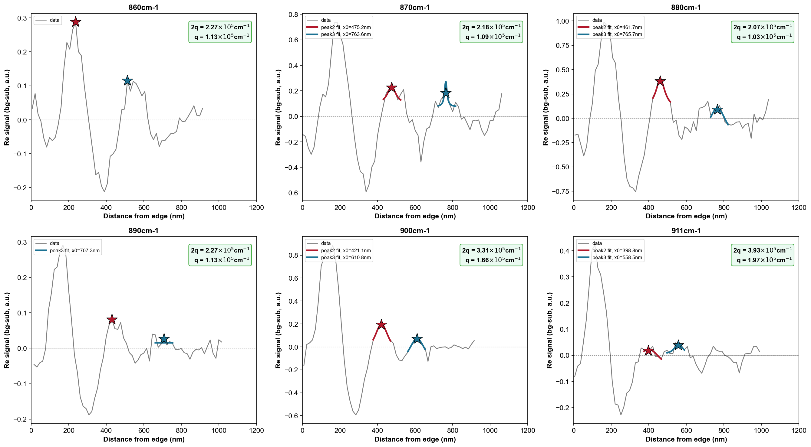 | 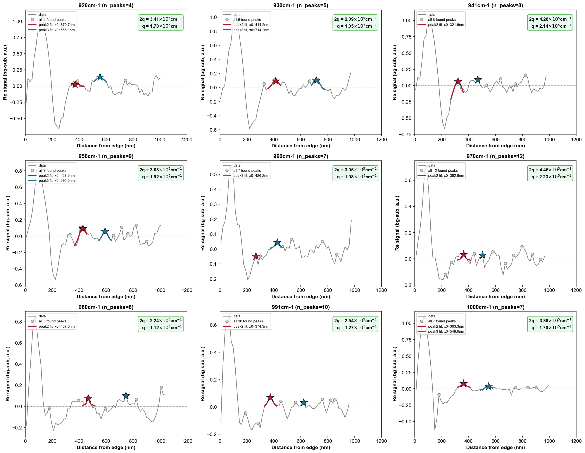 |

Takeaway: after correction, all 15 wn have peak2/peak3 sitting on genuine local maxima
(not valleys or shoulders). Two real, still-open discrepancies with the two-wave/FFT
consensus remain at 930 and 1000cm-1 (peak2-3 spacing gives ~40-50% lower q) — checked
directly against the raw signal values (not just the plot) and confirmed these aren't
mis-picked peaks; the real-space trace at those two wn has multiple close sub-peaks
rather than one clean oscillation lobe, so a different (but equally defensible) peak
choice could shift the answer — flagged as unresolved rather than forced to match.

Changelog:
- 2026-07-23: first pass with uniform default settings (0.08x tail-ptp relative
  prominence) across all 15 wn — several wn had wrong/missing peaks (870 picked two
  points on the same peak's shoulder; 960 similarly; 1000 had a runaway Lorentzian fit
  that blew out the plot's y-axis; several wn only found one of peak2/peak3).
- 2026-07-23 (fit-quality guard): added an amplitude-vs-local-ptp sanity check (reject a
  Lorentzian fit if `|A| > 10x` the local data range) alongside the existing
  gamma/x0-in-window checks — fixes the 1000cm-1 runaway-fit issue.
- 2026-07-23 (user review, round 1): user gave explicit peak2/peak3 nm positions for
  870/880/890/930/1000 by eye, and asked for 950/960/970/991 to be back-calculated from
  the established two-wave/FFT q (expected spacing = 2*pi/(2*q)). Added a
  `MANUAL_PEAK_XNM` hint mechanism: nearest actual detected local peak to each hint
  replaces the automatic pick.
- 2026-07-23 (user review, round 2): user caught that 980's peak3 and 991's peak2 (from
  round 1) were sitting in valleys, not peaks. Re-checked raw y-values directly (not just
  the plot) for 930/980/991/1000 -- found the round-1 hints for 930/1000 were on the
  *rising edge* of a lobe, not its actual maximum, and 980/991 hints from the automated
  back-calculation had genuinely landed in valleys. Corrected all 4 by inspecting the raw
  signal values wn by wn (see script comments for exact reasoning per wn).
- 2026-07-23 (fit-window test): tried widening `HALF_WIN` (sub-pixel fit window) 3→5,
  hoping wider windows would fit more robustly. Made things worse (930/960 pulled onto
  the wrong shoulder, more fits degenerated to raw-grid fallback) — reverted to 3.
  Wider isn't better here because it's more likely to pull in a competing
  neighboring feature (another peak or a valley), not because the window was too narrow.

---

## 4. Two-wave Hankel model (q + 2q)

Real-space fit as the sum of two Hankel terms sharing one physical q: an edge-launched
"q" term plus the usual tip-launched round-trip "2q" term. Motivated by the FFT's own
2-peak decomposition showing a non-negligible "q" peak starting ~900cm-1 — the
single-wave Hankel/1-√x fits only ever modeled "2q" and become unreliable once "q"
isn't negligible.

**Latest** (2026-07-22), representative wn across the 900-1000cm-1 range:

| 900cm-1 | 950cm-1 | 1000cm-1 |
|---|---|---|
|  |  |  |

(Full set of 11 wn: `figures/graphene_4x1_manual/lp1/two_wave_hankel/`.)

Takeaway: two-wave fit visibly tracks the data better than single-wave at high wn, most
dramatically at 1000cm-1 where single-wave hankel gives an outlier q (373999cm-1) vs.
two-wave's 242187cm-1, which agrees much better with every other independent method.
Q factor (`Re(q_p)/Im(q_p)`) is consistently higher for the 2q term than the q term
across all 11 wn — physically sensible (tip round-trip mode cleaner than the
edge-launched one).

Changelog:
- 2026-07-22: `fit_hankel_two_wave` added to `envsetting/snippet/dispersion_fitting.py`;
  11 notebook cells (900-1000cm-1) added and tuned in
  `fitting_pipeline_graphene_4x1_lp1.ipynb`. Tested and rejected constraining the fit to
  the actually-measured phase channel instead of a free/fitted phase (~7-8x worse RMSE —
  measured phase is nearly flat, can't reproduce the sign changes in background-
  subtracted amplitude). PPTX overview built: `slides/GMG_two_wave_hankel_900to1000.pptx`.

---

## 5. Starting-point (fit window) sensitivity, 860-911cm-1

Checks how much the fitted q_p depends on where the real-space fit window starts —
i.e. is the "safe" x-range we're using for `xr` actually safe, or is the fit quietly
unstable near the edge. Same methodology for both edges (§5a lp1, §5b lp2); kept as one
section since it's one topic, not two.

### 5a. lp1 (left edge)

**Latest** (established 2026-07-17):

| Hankel | 1/√x |
|---|---|
|  |  |

Takeaway: q_p is stable (flat) over a clear "good" starting-point range for both models
at 860-911cm-1; 911cm-1 shows a wild swing (0.72x-1.21x mean) right inside the region
that looks clean for hankel, meaning that particular instability is hankel-specific, not
universal to the real-space fit itself.

Changelog:
- 2026-07-17: established for 860-911cm-1. Not yet extended to 920-1000cm-1.

### 5b. lp2 (right edge)

**Latest** (2026-07-23, against the re-extracted 2x-width linecuts):

| Hankel | 1/√x |
|---|---|
| 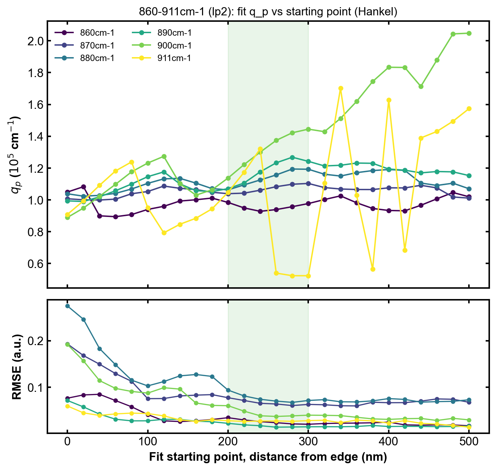 | 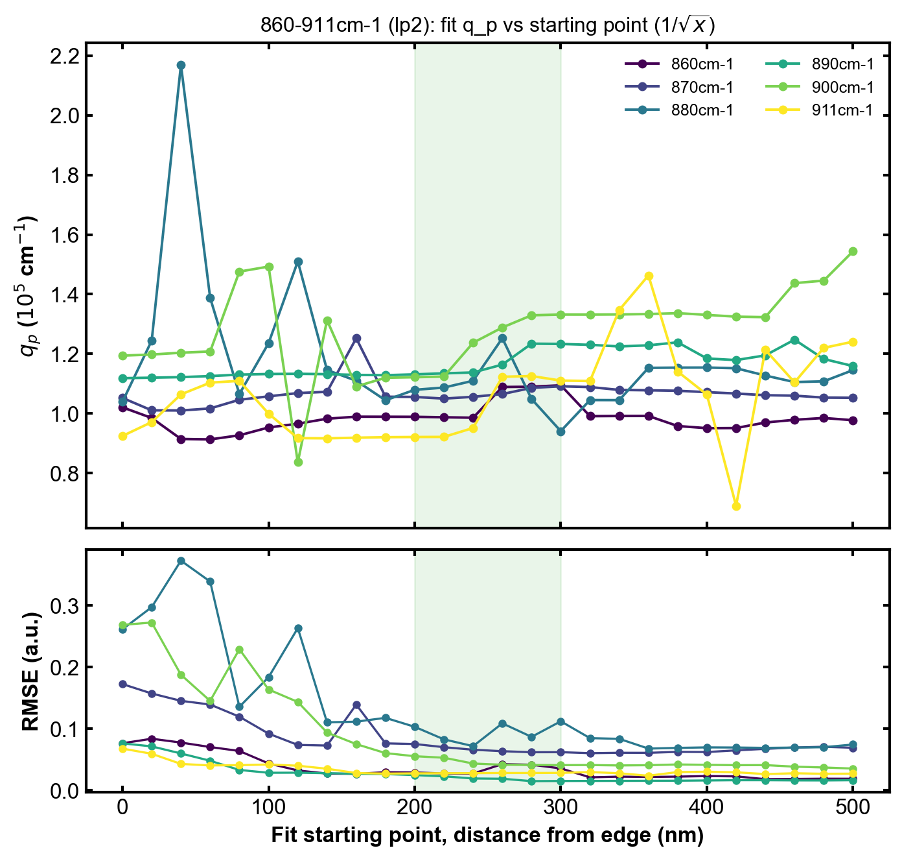 |

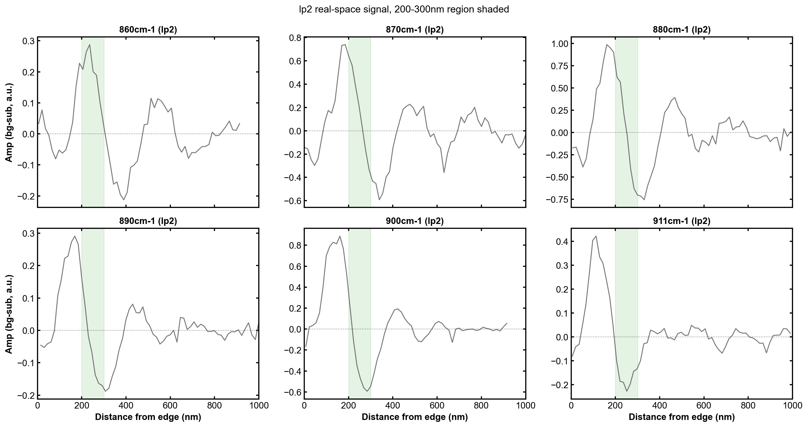

Takeaway: unlike lp1, **Hankel is unstable for 900/911cm-1 across the entire 0-500nm
scan** (900cm-1 never plateaus, climbing the whole way; 911cm-1 hops between local
minima). **1/√x is comparably well-behaved for all 6 wn including 900/911** over roughly
200-380nm. Read as evidence — independent of the FFT peak count — that the edge-launched
wave is non-negligible for lp2 starting at 900cm-1 too, and that the instability there is
a model-choice problem (use two-wave, §4 for lp1's version / lp2's cells pending tuning),
not a start-point-tuning problem. Good-point region for the 860-890 well-behaved subset:
200-300nm (narrower than lp1's 260-340nm — lp2's linecut is only ~1000nm total, so a
wider window eats too much of an already-short usable range).

Changelog:
- 2026-07-23: established against the newly re-extracted (2x averaging width) lp2 data.

---

## 6. Cross-check: lp2 vs. an independent (collaborator) linecut extraction

Sanity check that our lp2 raw linecut data itself is trustworthy, independent of any
fitting-model question: a labmate (Weicheng) separately extracted the same MoO3/graphene
4x1um lp2 (interior) region's O3 amplitude, from the same underlying scan but with their
own extraction pipeline/starting point. `data/Weicheng's linecut/4x1um_lp2/
MoO3_interior_S3amp_linecuts_waterfall.csv` (O3 amp only, no phase, wn=860-980cm-1 —
missing 991/1000).

**Latest** (2026-07-23):
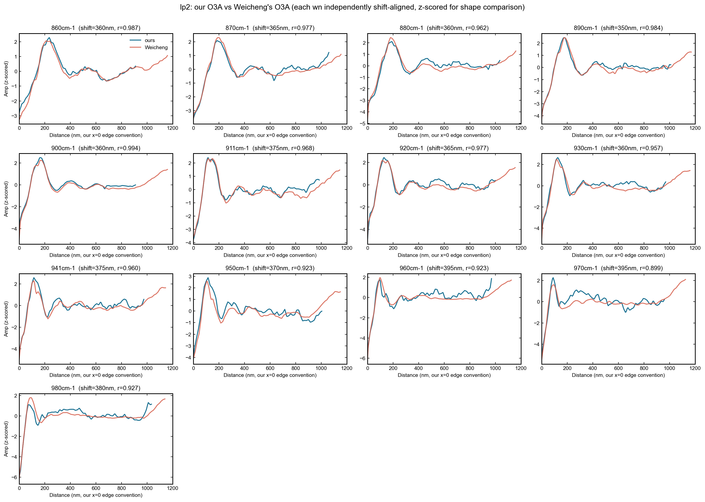

Takeaway: the two extractions' starting points genuinely differ (as suspected) — cross-
correlation per wn finds a consistent **370±13nm offset** (collaborator's x=0 starts
~370nm before our own aligned edge) across all 13 shared wn, not just a couple. After
shifting to a common frame and z-scoring both (absolute scales/normalization aren't
comparable, only shape is), agreement is strong: **r=0.90-0.99**, mostly >0.95. This
validates that our lp2 raw data matches an independently-extracted linecut well — the
Hankel instability found in §5b is a fitting-model issue, not a data-quality one.

Changelog:
- 2026-07-23: first comparison against collaborator data, established the alignment
  method (per-wn cross-correlation, not assumed-equal start points) and the offset/
  agreement numbers above.
- 2026-07-23 (follow-up): saved as a permanent script,
  `scripts/compare_with_weicheng_linecut.py` (was ad hoc before); added explicit x-axis
  tick labels/numbers to every panel (previously only the bottom row showed them, a
  `sharex` default) and a fixed 0-1200nm tick grid every 200nm.
