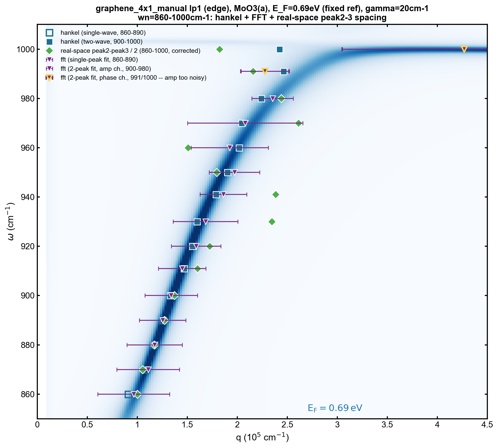
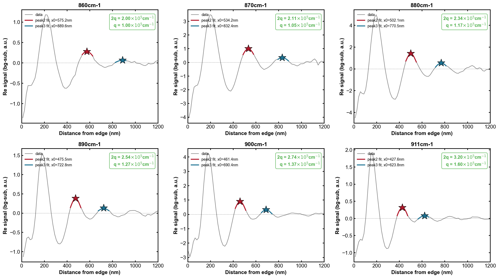
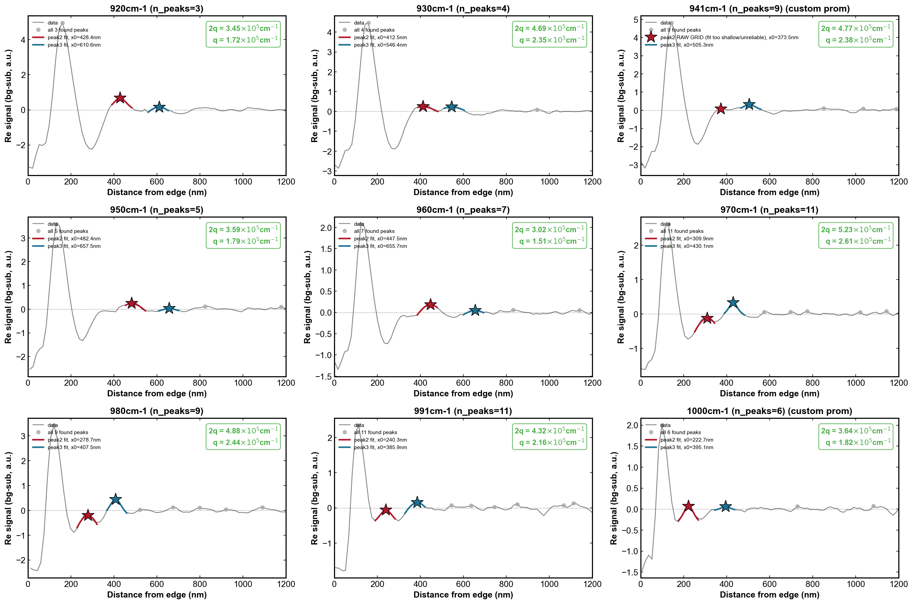
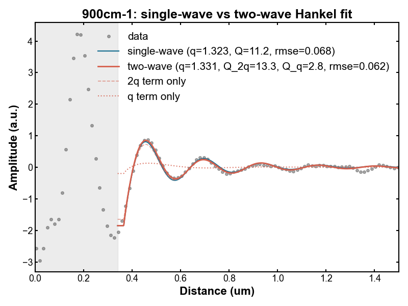
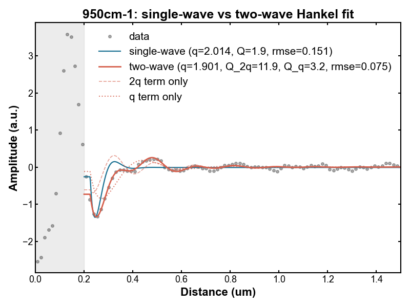
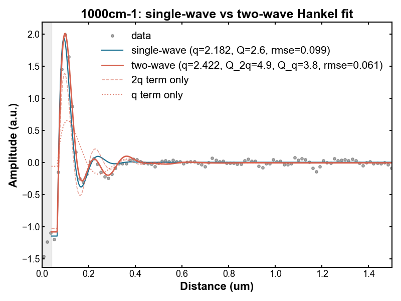
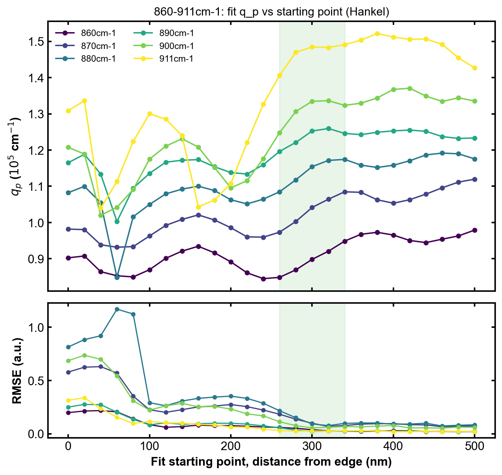
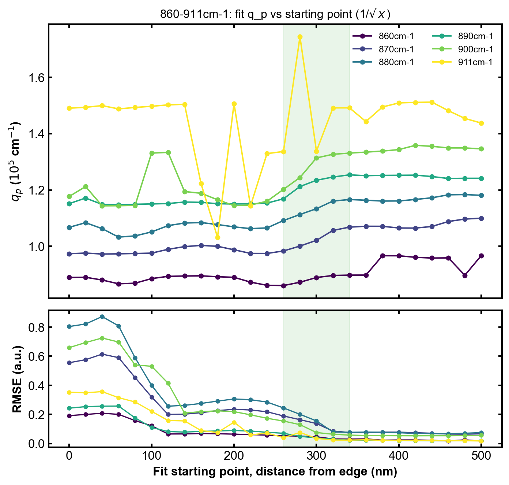
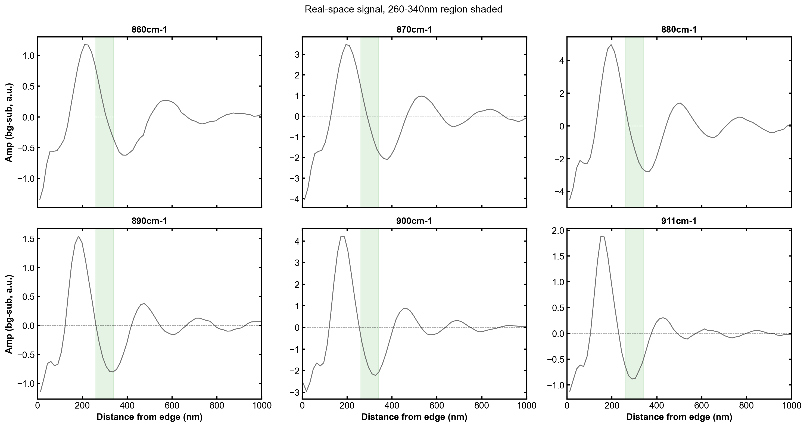

# GMG — SI-Quality Figures & Progress Snapshot

Curated, maintained-quality figures for this project, organized by topic/method rather
than strictly by date. Each section leads with the **current** figure(s) + a one-line
takeaway, followed by a short dated changelog of what changed and why. This is a
*selection*, not a full history — for every change (including ones later superseded),
see `log_and_conventions.md`. Only `graphene_4x1_manual` lp1 (edge) is covered so far;
add sections for `graphene_3x1_manual` / lp2 once their own tuning settles.

**Maintenance**: update opportunistically (a major method change or a result worth
keeping), not every session/day.

---

## 1. Dispersion overview: rp(q,ω) cross-check

Combines every independent q_p estimate (hankel, FFT, real-space peak spacing) on top
of the simulated Im(r_p) ridge — the single best "does everything agree" figure for
graphene_4x1_manual lp1.

**Latest** (2026-07-22):

Takeaway: all 4 methods agree well with the ridge for 860-920 and 950/980cm-1; 930/941/
960/970/991 show real per-point scatter (~10-20%) that isn't resolved by any single
method; 1000cm-1 remains the least certain point (two-wave hankel and peak2-3 spacing
agree reasonably at ~1.8-2.4e5 cm-1, but FFT is unresolved on both channels there).

Changelog:
- 2026-07-16: FFT added to the cross-check with FWHM error bars; peak labeling fixed to
  a physics-based "always 2q, /2-corrected" convention.
- 2026-07-17: amp/complex FFT channel degeneracy explained (not a bug — phase is nearly
  flat in the tuned fit window, so `|FFT(complex)| ~ |FFT(amp)|`).
- 2026-07-22: extended from 860-911 to the full 860-1000cm-1 range — added two-wave
  Hankel fits and real-space peak2-peak3 spacing for 920-1000cm-1; fixed a peak
  misidentification at 941 and 1000cm-1 (see §2); switched the FFT point at 991/1000cm-1
  from amp to phase channel (amp too noisy at these two wn).

---

## 2. Real-space peak2-peak3 spacing diagnostic

Independent q_p cross-check that doesn't depend on any fitting model — just the spacing
between the 2nd and 3rd real-space oscillation peaks. Needs a visual check per wn since
peak-picking (prominence threshold, sub-pixel Lorentzian refine) can silently lock onto
the wrong peak, which text/numbers alone don't reveal.

**Latest** (860-911cm-1, established 2026-07-13):

**Latest** (920-1000cm-1, corrected 2026-07-22):

Takeaway: peak2/peak3 identification confirmed correct for 920/930/950/960/970/980/991.
941 and 1000cm-1 required per-wn prominence-threshold overrides (not a general rule —
see changelog) to pick the right peaks.

Changelog:
- 2026-07-13: method established and validated for 860-911cm-1.
- 2026-07-22: extended to 920-1000cm-1. Default relative-prominence threshold
  misidentified peaks at two wn: 941cm-1 missed a real small peak (~373.5nm) and used a
  noise point instead (q corrected 0.888→2.383 ×1e5cm-1); 1000cm-1 let a spurious
  near-edge shoulder through as a false first peak, shifting every later index (q
  corrected 2.676→1.822 ×1e5cm-1). Fixed with narrowly-scoped absolute-prominence
  overrides for just those two wn — an earlier attempt at a *general* "large fitted
  width → fall back to raw grid" rule was tried and reverted because it also silently
  changed 920/930's already-correct results.

---

## 3. Two-wave Hankel model (q + 2q)

Real-space fit as the sum of two Hankel terms sharing one physical q: an edge-launched
"q" term plus the usual tip-launched round-trip "2q" term. Motivated by the FFT's own
2-peak decomposition showing a non-negligible "q" peak starting ~900cm-1 — the
single-wave Hankel/1-√x fits only ever modeled "2q" and become unreliable once "q"
isn't negligible.

**Latest** (2026-07-22), representative wn across the 900-1000cm-1 range:

| 900cm-1 | 950cm-1 | 1000cm-1 |
|---|---|---|
|  |  |  |

(Full set of 11 wn: `figures/graphene_4x1_manual/lp1/two_wave_hankel/`.)

Takeaway: two-wave fit visibly tracks the data better than single-wave at high wn, most
dramatically at 1000cm-1 where single-wave hankel gives an outlier q (373999cm-1) vs.
two-wave's 242187cm-1, which agrees much better with every other independent method.
Q factor (`Re(q_p)/Im(q_p)`) is consistently higher for the 2q term than the q term
across all 11 wn — physically sensible (tip round-trip mode cleaner than the
edge-launched one).

Changelog:
- 2026-07-22: `fit_hankel_two_wave` added to `envsetting/snippet/dispersion_fitting.py`;
  11 notebook cells (900-1000cm-1) added and tuned in
  `fitting_pipeline_graphene_4x1_lp1.ipynb`. Tested and rejected constraining the fit to
  the actually-measured phase channel instead of a free/fitted phase (~7-8x worse RMSE —
  measured phase is nearly flat, can't reproduce the sign changes in background-
  subtracted amplitude). PPTX overview built: `slides/GMG_two_wave_hankel_900to1000.pptx`.

---

## 4. Starting-point (fit window) sensitivity, 860-911cm-1

Checks how much the fitted q_p depends on where the real-space fit window starts —
i.e. is the "safe" x-range we're using for `xr` actually safe, or is the fit quietly
unstable near the edge.

**Latest** (established 2026-07-17):

| Hankel | 1/√x |
|---|---|
|  |  |

Takeaway: q_p is stable (flat) over a clear "good" starting-point range for both models
at 860-911cm-1; 911cm-1 shows a wild swing (0.72x-1.21x mean) right inside the region
that looks clean for hankel, meaning that particular instability is hankel-specific, not
universal to the real-space fit itself.

Changelog:
- 2026-07-17: established for 860-911cm-1. Not yet extended to 920-1000cm-1.
